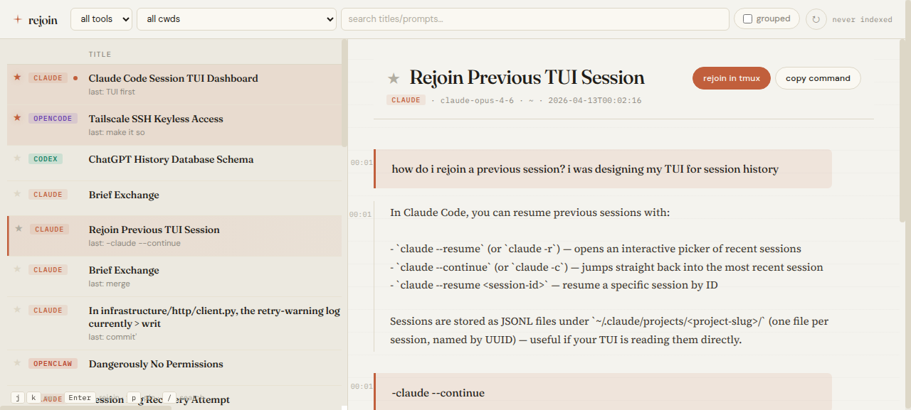

# session-dash

A local dashboard for browsing and rejoining Claude Code + Codex sessions on your machine.



It walks `~/.claude/projects/**/*.jsonl` and `~/.codex/sessions/**/*.jsonl`, indexes the lot into SQLite, auto-titles each session via a cheap OpenRouter model, and lets you rejoin any session in a detached `tmux` — all from a warm beige UI that borrows heavily from Claude.ai's aesthetic.

- **Dual-tool**: indexes both Claude Code and Codex session files.
- **Auto titles**: every session gets a human-readable title from `qwen/qwen3-30b-a3b-instruct-2507` (~$7e-6 per title). Falls back to the first prompt if the API is down.
- **Rejoin in tmux**: one click spawns a detached `tmux` session in the original `cwd`; the UI gives you the attach command.
- **Incremental**: re-scans every 60s, skipping anything whose mtime is unchanged. Titles only regenerate when content actually changed.
- **Search**: FTS5 over titles, first-and-last prompts, and Codex compaction summaries, with hit highlighting.
- **Group by cwd**: nest the list under sticky project headers.
- **Pin favorites**: ★ any session to float it to the top.
- **Active indicator**: sessions touched in the last 2 min pulse in the list and detail pane.
- **Keyboard-first**: `j`/`k` / `↑`/`↓` navigate, `Enter` rejoins, `p` pins, `/` focuses search.

## Install

Requires Python 3.11+ (uses `tomllib`), `tmux`, and Claude Code / Codex CLIs on `$PATH` (only needed at resume time).

```bash
git clone <repo-url> ~/AI/tools/session-dash
cd ~/AI/tools/session-dash
python3 -m venv .venv
.venv/bin/pip install -r requirements.txt
```

The titler needs an OpenRouter API key. Set `OPENROUTER_API_KEY` in your environment, or drop it in a `.env` that `python-dotenv` can find. (The bundled `config.py` also falls back to reading the key from `~/AI/projects/Paa Prefab CRM/.env` — delete that branch if it's not useful to you.)

## Run

Two front-ends share the same SQLite index; run either or both.

**Web** (FastAPI + HTMX):

```bash
./run.sh
```

Binds `0.0.0.0:8767` by default (reachable from Tailnet peers). Override via config or env:

```bash
SESSION_DASH_HOST=127.0.0.1 SESSION_DASH_PORT=9000 ./run.sh
```

Open `http://127.0.0.1:8767/` (or launch a Chrome app window with `google-chrome --app=http://127.0.0.1:8767/ --user-data-dir=/tmp/chrome-session-dash`).

**Terminal** (Textual TUI, tmux-aware):

```bash
./run-tui.sh
```

If launched inside tmux, pressing `Enter` on a row opens a new tmux window in the current session and switches to it. Outside tmux, it starts a detached session and prints the attach command in the status bar. Pins, titles, active indicator, FTS search, and the 30-second refresh interval all carry over from the web version.

## Shortcuts

| key | action |
| --- | --- |
| `j` / `↓` | next session |
| `k` / `↑` | previous session |
| `g` | jump to top |
| `Enter` | rejoin the selected session in tmux |
| `p` | pin / unpin the open session |
| `/` | focus search |
| `Esc` | blur search |

Click the amber **★** next to any row to pin without opening it. Click the **↻** in the header to force a reindex + titling pass; the label next to it always shows `indexed Ns ago`.

## Configuration

Everything tunable lives in `~/.config/session-dash/config.toml`. A commented example is at [`config.example.toml`](config.example.toml); copy to the config path and edit.

```toml
# ~/.config/session-dash/config.toml
model              = "qwen/qwen3-30b-a3b-instruct-2507"   # OpenRouter slug
title_concurrency  = 8
refresh_interval_sec = 60
active_window_sec  = 120
transcript_tail    = 40
turn_cache_size    = 16
long_turn_lines    = 30
long_turn_chars    = 1500
host               = "0.0.0.0"
port               = 8767
```

Missing keys fall back to defaults. Bad TOML prints a warning to stderr and uses defaults.

## Storage

| path | purpose |
| --- | --- |
| `~/.local/share/session-dash/index.db` | SQLite index of sessions, titles, pins, and FTS5 |
| `~/.config/session-dash/config.toml` | your overrides (optional) |
| `~/.claude/projects/**/*.jsonl` | Claude Code source (read-only) |
| `~/.codex/sessions/**/*.jsonl` | Codex source (read-only) |

session-dash **never writes** to Claude/Codex session files. The SQLite DB is a pure cache and can be deleted to force a clean reindex.

## Architecture

```
session_dash/
├── common.py      # Tool Literal, iter_jsonl, text_of, utcnow_iso, short_cwd
├── config.py      # tomllib loader + defaults
├── db.py          # sqlite schema (sessions, titles, pins, session_fts)
├── indexer.py     # jsonl parsers + reindex() — PARSERS = {"claude":…, "codex":…}
├── titler.py      # async OpenRouter batch with concurrency cap + content-hash skip
├── transcript.py  # turn extraction for rendering (lazy, LRU-cached at the route layer)
├── resume.py      # builds `cd <cwd> && <tool> --resume <id>` and launches via tmux
└── app.py         # FastAPI routes, background refresh loop, HTMX templates
```

The `indexer.py` → `titler.py` → `app.py` pipeline is decoupled: indexer knows nothing about titles; titler knows nothing about the UI. Adding a third tool means one new parser in `PARSERS` and one new branch in `resume.py`.

## Troubleshooting

- **"no OPENROUTER_API_KEY found"** — export it in your shell, or point `config.py` at a `.env` that has it.
- **titles aren't updating for active sessions** — the content hash guards against redundant API calls; a session needs to actually change prompt/summary text to re-title.
- **tmux session already running** — rejoin reuses `sess-<tool>-<uuid8>` if it's still alive. Kill it with `tmux kill-session -t sess-…` if you want a fresh start.
- **port already in use** — `ss -tln | grep :<port>` to see who has it; change `port` in config.

## License

MIT. See [LICENSE](LICENSE).
