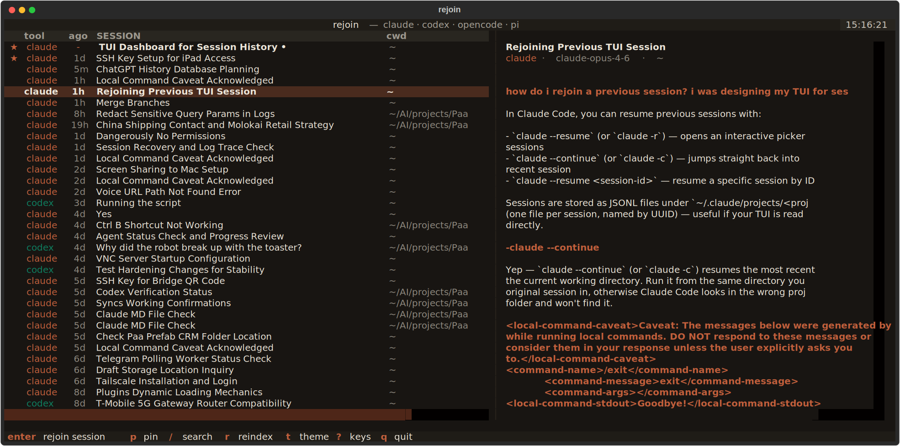

# rejoin

[](https://www.python.org/downloads/)
[](LICENSE)
[](CHANGELOG.md)

A local dashboard for browsing and rejoining AI coding-agent sessions (Claude Code, Codex, OpenCode, Pi).

Two front-ends that share one SQLite cache:

### 🖥️ Web UI &nbsp;— FastAPI + HTMX

A warm-beige browser dashboard borrowed from Claude.ai's visual identity. Scan sessions in a two-pane layout, read the transcript in typographic serif/sans, click **rejoin in tmux** to pick back up where you left off.


### ⌨️ Terminal UI &nbsp;— Textual, tmux-aware

The same dashboard as a first-class TUI. Inside tmux, pressing `Enter` on a row opens a new window in the current session and switches to it — no browser, no attach command, zero friction.



---

Under the hood: indexes session files from four agents into SQLite, auto-titles each session via a cheap OpenRouter model, and lets you rejoin any session in `tmux`.

- **Four tools**: Claude Code and Codex (our own parsers — richer detail); OpenCode and Pi via [`agent-sessions`](https://github.com/larsderidder/agent-sessions).
- **Auto titles**: `qwen/qwen3-30b-a3b-instruct-2507` (~$7e-6 per title). Falls back to the first prompt if no key.
- **Rejoin in tmux**: one click. Detached by default; inside tmux the TUI opens a new window in the current server.
- **Incremental** reindex every 60 s, skipping unchanged mtimes.
- **Search** (FTS5) with hit highlighting; **group by cwd**; **pin favorites** (★ floats to top).
- **Active indicator**: pulses when (a) session file touched in last 2 min OR (b) a matching `--resume <id>` / `codex resume <id>` / `pi <id>` process is live.
- **Keyboard-first**: `j`/`k`/`↑`/`↓` navigate, `Enter` rejoins, `p` pins, `/` focuses search.

---

## Install (agent-friendly, copy-paste this exact sequence)

### 1. Prerequisites

Verify each of these returns a success exit code before continuing.

```bash
python3 --version              # must print 3.11 or higher
git --version                  # any version
tmux -V                        # any version; required only for rejoin clicks
```

If `python3` is older than 3.11:

- Ubuntu/Debian: `sudo apt install python3.12 python3.12-venv`
- macOS (Homebrew): `brew install python@3.12`

If `tmux` is missing:

- Ubuntu/Debian: `sudo apt install tmux`
- macOS: `brew install tmux`

### 2. Clone

```bash
git clone https://github.com/akakabrian/rejoin.git ~/AI/tools/rejoin
cd ~/AI/tools/rejoin
```

The target path is arbitrary; `~/AI/tools/rejoin` is an example.

### 3. Virtual env + install

```bash
python3 -m venv .venv
.venv/bin/pip install --upgrade pip
.venv/bin/pip install -e '.[dev]'
```

Verify:

```bash
.venv/bin/python -c "from rejoin.app import main; from rejoin.tui import main as tmain; print('ok')"
# expected output: ok
```

### 4. Provide an OpenRouter API key (optional but recommended)

Without a key, sessions get a fallback title (truncated first prompt). With a key, they get a ~5-word LLM-generated title for about $7×10⁻⁶ each.

Pick one of three methods, in priority order:

**Method A — shell env (most portable):**

```bash
export OPENROUTER_API_KEY="sk-or-v1-…"
```

**Method B — project-local `.env` (default for agents):**

```bash
echo 'OPENROUTER_API_KEY=sk-or-v1-…' > .env
chmod 600 .env
```

This file is gitignored. It's the method most automated setups should use.

**Method C — point at an existing `.env`:**

```bash
export OPENROUTER_ENV_FILE="/path/to/existing/.env"
```

Verify:

```bash
.venv/bin/python -c "from rejoin.config import openrouter_api_key; print('key:', 'yes' if openrouter_api_key() else 'no')"
# expected: key: yes  (or 'no' if you skipped this step)
```

### 5. Run

```bash
./run.sh
```

Expected output on stdout:

```
INFO:     Started server process [NNNN]
INFO:     Waiting for application startup.
INFO:     Application startup complete.
INFO:     Uvicorn running on http://127.0.0.1:8767
```

Open `http://127.0.0.1:8767/` in a browser. Or launch as a Chrome app window:

```bash
google-chrome --app=http://127.0.0.1:8767/ --user-data-dir=/tmp/chrome-rejoin &
```

### 6. Verify end-to-end

```bash
curl -s http://127.0.0.1:8767/status
# expected: {"last_indexed_age_s": <small number>}

curl -s -o /dev/null -w "%{http_code}\n" http://127.0.0.1:8767/
# expected: 200
```

To use the **terminal UI** instead:

```bash
./run-tui.sh
```

---

## Configuration

Create `~/.config/rejoin/config.toml` to override defaults. Every key is optional; see [`config.example.toml`](config.example.toml) for the full annotated list.

```toml
# ~/.config/rejoin/config.toml
host                 = "127.0.0.1"    # "0.0.0.0" ONLY on trusted networks
port                 = 8767
model                = "qwen/qwen3-30b-a3b-instruct-2507"
transcript_tail      = 40
active_window_sec    = 120
long_turn_lines      = 30
long_turn_chars      = 1500
refresh_interval_sec = 60
title_concurrency    = 8
turn_cache_size      = 16
```

Bad TOML prints a warning to stderr and falls back to defaults. Missing file → all defaults.

## Shortcuts

| key | action |
| --- | --- |
| `j` / `↓` | next session |
| `k` / `↑` | previous session |
| `g` | jump to top |
| `Enter` | rejoin the selected session in tmux |
| `p` | pin / unpin the open session |
| `/` | focus search |
| `Esc` | blur / clear search |

Click the amber **★** on any row to pin/unpin without opening the session. Click **↻** in the header to force a reindex; the `indexed Ns ago` label confirms the background loop is alive.

## Storage

| path | purpose |
| --- | --- |
| `~/.local/share/rejoin/index.db` | SQLite cache (sessions, titles, pins, FTS5) — safe to delete |
| `~/.config/rejoin/config.toml` | your overrides (optional) |
| `<project>/.env` | project-local OpenRouter key (optional, gitignored) |
| `~/.claude/projects/**/*.jsonl` | Claude Code source (read-only) |
| `~/.codex/sessions/**/*.jsonl` | Codex source (read-only) |
| `~/.local/share/opencode/opencode.db` | OpenCode source (read-only) |
| `~/.pi/agent/sessions/**/*.jsonl` | Pi source (read-only) |

rejoin **never writes** to session files. It only reads. The SQLite index is a pure cache; deleting it forces a clean reindex on next launch (titles re-generate).

## Security / privacy

The dashboard exposes your full transcript history — every prompt, every tool call, every response. Treat it as sensitive:

- **Default bind is `127.0.0.1`.** The server is reachable only from the same machine.
- **Only set `host = "0.0.0.0"`** on machines where you trust every peer on the network (e.g. a Tailnet-only host). There is no authentication.
- Transcripts may include pasted secrets. Deleting a session file in `~/.claude` or `~/.codex` leaves the data in rejoin's SQLite cache until the next reindex-with-delete. If you want to purge: stop the server, delete `~/.local/share/rejoin/index.db`, restart.

## Architecture

```
rejoin/
├── common.py      # Tool Literal, iter_jsonl, text_of, utcnow_iso, short_cwd
├── config.py      # tomllib loader + defaults
├── db.py          # SQLite schema (sessions, titles, pins, session_fts); schema-version guard
├── indexer.py     # Claude + Codex parsers; PARSERS registry; OpenCode+Pi via external.py
├── titler.py      # async OpenRouter batch; concurrency cap; content-hash skip
├── transcript.py  # turn extraction (claude, codex); opencode+pi delegate to external.py
├── resume.py      # `cd <cwd> && <tool> --resume <id>`; tmux launch; missing-binary check
├── external.py    # adapter for Lars de Ridder's agent-sessions library
├── app.py         # FastAPI routes, background refresh loop, HTMX templates
├── tui.py         # Textual TUI app, tmux-aware rejoin
├── tui.tcss       # TUI stylesheet
├── templates/     # HTMX-rendered HTML fragments
└── static/        # web CSS + JS
```

## Troubleshooting

| symptom | fix |
| --- | --- |
| `'tmux' not found on PATH` in the resume response | install tmux (`sudo apt install tmux` or `brew install tmux`) |
| port 8767 already in use | set `port = <other>` in config, or `REJOIN_PORT=<other> ./run.sh` |
| titles stuck at truncated first prompt | `OPENROUTER_API_KEY` not found; see step 4 above |
| dashboard is empty | you have no Claude/Codex/OpenCode/Pi sessions yet; run one and click ↻ |
| `Schema version mismatch` on startup | back up and delete `~/.local/share/rejoin/index.db`, restart |
| TUI shows no transcript on first launch | click any row; the first-paint transcript load races with the cursor init |

## Tests

```bash
.venv/bin/pytest -q
.venv/bin/ruff check rejoin tests
```

## Credits

OpenCode + Pi providers and running-process detection come from [`agent-sessions`](https://github.com/larsderidder/agent-sessions) by Lars de Ridder (MIT).

## License

MIT. See [LICENSE](LICENSE).
